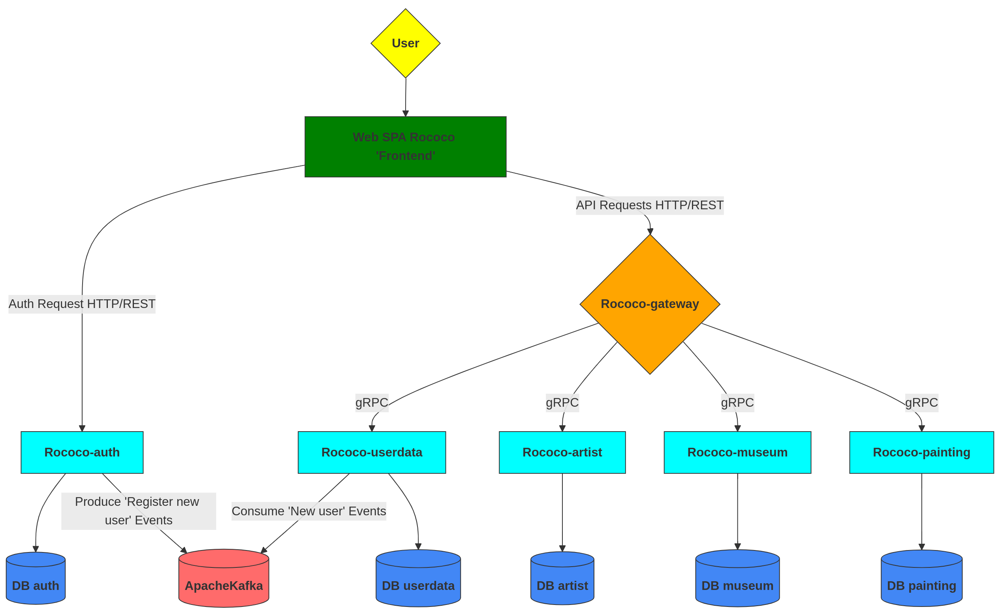
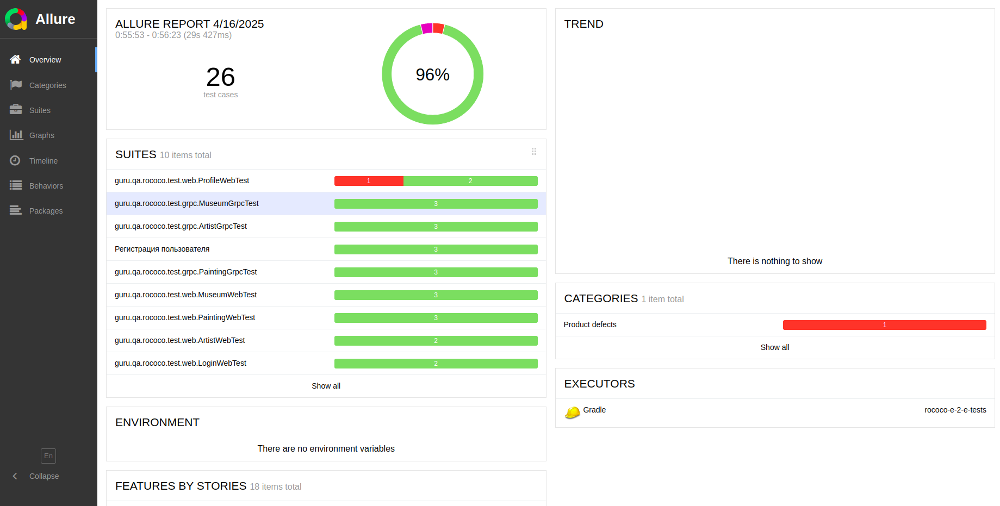
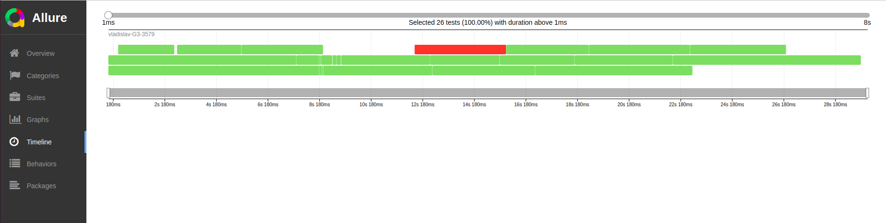
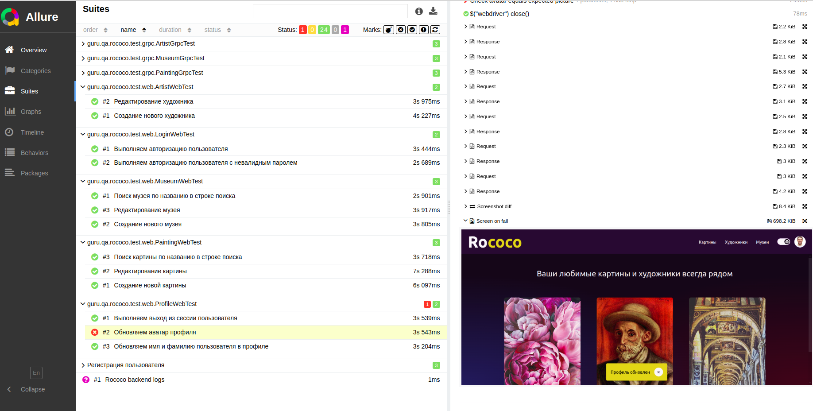

# Rococo - платформа для коллекционеров искусства


## 📋 Описание проекта

**Rococo** - это платформа для коллекционирования произведений искусства, предоставляющая:

- 🎨 Полноценный каталог художников, музеев и картин
- 🔐 Безопасную аутентификацию через OAuth 2.0
- 📚 Возможность создания персональных коллекций
- 🏗 Микросервисную архитектуру

## 🔥 Основные возможности

### Безопасность и аутентификация
- Авторизация через Spring Authorization Server
- Поддержка OAuth 2.0 и JWT
- Персонализированный доступ к управлению контентом

### Управление контентом
- CRUD операции для художников, музеев и картин
- Гибкая система поиска и фильтрации
- Поддержка загрузки изображений

### Пользовательский функционал
- Личные коллекции произведений
- История просмотров
- Избранные работы

## ⚙️ Технологический стек

### Основные технологии
| Категория       | Технологии                     |
|-----------------|--------------------------------|
| Бэкенд          | Java 21, Spring Boot 3.2, gRPC |
| Базы данных     | PostgreSQL 15                  |
| Брокер сообщений| Apache Kafka 7.3.2             |
| Фронтенд        | Svelte, Thymeleaf              |
| Инфраструктура  | Docker, Selenoid, Allure       |

**Схема проекта Rococo**



# Минимальные предусловия для работы с проектом Rococo

#### 1. Установить docker (Если не установлен)

Мы будем использовать docker для БД (Postgres), кроме того, будем запускать микросервисы в едином docker network при
помощи docker-compose

[Установка на Windows](https://docs.docker.com/desktop/install/windows-install/)

[Установка на Mac](https://docs.docker.com/desktop/install/mac-install/) (Для ARM и Intel разные пакеты)

[Установка на Linux](https://docs.docker.com/desktop/install/linux-install/)

После установки и запуска docker daemon необходимо убедиться в работе команд docker, например `docker -v`:

```posh
User-MacBook-Pro ~ % docker -v
Docker version 20.10.14, build a224086
```

#### 2. Спуллить контейнер postgres:15.1, zookeeper и kafka версии 7.3.2

```posh
docker pull postgres:15.1
docker pull confluentinc/cp-zookeeper:7.3.2
docker pull confluentinc/cp-kafka:7.3.2
```

После `pull` вы увидите спуленный image командой `docker images`

```posh
User-MacBook-Pro ~ % docker images            
REPOSITORY                 TAG              IMAGE ID       CREATED         SIZE
postgres                   15.1             9f3ec01f884d   10 days ago     379MB
confluentinc/cp-kafka      7.3.2            db97697f6e28   12 months ago   457MB
confluentinc/cp-zookeeper  7.3.2            6fe5551964f5   7 years ago     451MB

```

#### 3. Создать volume для сохранения данных из БД в docker на вашем компьютере

```posh
docker volume create pgdata
```

#### 4. Запустить БД, zookeeper и kafka 3-мя последовательными командами:

Запустив скрипт (Для Windows необходимо использовать bash terminal: gitbash, cygwin или wsl)

```posh
User-MacBook-Pro  rococo % bash localenv.sh
```

Или выполнив последовательно команды, для *nix:

```posh
docker run --name rococo-all -p 5432:5432 -e POSTGRES_PASSWORD=secret \
  -e CREATE_DATABASES=rococo-auth,rococo-userdata,rococo-museum,rococo-artist,rococo-painting \
  -v pgdata:/var/lib/postgresql/data \
  -v ./postgres/init-database.sh:/docker-entrypoint-initdb.d/init-database.sh \
  -d postgres:15.1 --max_prepared_transactions=100
  
docker run --name=zookeeper -e ZOOKEEPER_CLIENT_PORT=2181 -p 2181:2181 -d confluentinc/cp-zookeeper:7.3.2

docker run --name=kafka -e KAFKA_BROKER_ID=1 \
-e KAFKA_ZOOKEEPER_CONNECT=$(docker inspect zookeeper --format='{{ .NetworkSettings.IPAddress }}'):2181 \
-e KAFKA_ADVERTISED_LISTENERS=PLAINTEXT://localhost:9092 \
-e KAFKA_OFFSETS_TOPIC_REPLICATION_FACTOR=1 \
-e KAFKA_TRANSACTION_STATE_LOG_MIN_ISR=1 \
-e KAFKA_TRANSACTION_STATE_LOG_REPLICATION_FACTOR=1 \
-p 9092:9092 -d confluentinc/cp-kafka:7.3.2
```

Для Windows (Необходимо использовать bash terminal: gitbash, cygwin или wsl):

```posh
docker run --name rococo-all -p 5432:5432 -e POSTGRES_PASSWORD=secret \
  -e CREATE_DATABASES=rococo-auth,rococo-userdata,rococo-museum,rococo-artist,rococo-painting \
  -v pgdata:/var/lib/postgresql/data \
  -v ./postgres/init-database.sh:/docker-entrypoint-initdb.d/init-database.sh \
  -d postgres:15.1 --max_prepared_transactions=100
  
docker run --name=zookeeper -e ZOOKEEPER_CLIENT_PORT=2181 -p 2181:2181 -d confluentinc/cp-zookeeper:7.3.2

docker run --name=kafka -e KAFKA_BROKER_ID=1 \
-e KAFKA_ZOOKEEPER_CONNECT=$(docker inspect zookeeper --format='{{ .NetworkSettings.IPAddress }}'):2181 \
-e KAFKA_ADVERTISED_LISTENERS=PLAINTEXT://localhost:9092 \
-e KAFKA_OFFSETS_TOPIC_REPLICATION_FACTOR=1 \
-e KAFKA_TRANSACTION_STATE_LOG_MIN_ISR=1 \
-e KAFKA_TRANSACTION_STATE_LOG_REPLICATION_FACTOR=1 \
-p 9092:9092 -d confluentinc/cp-kafka:7.3.2
```

[Про IP zookeeper](https://github.com/confluentinc/cp-docker-images/issues/801#issuecomment-692085103)

Если вы используете Windows и контейнер с БД не стартует с ошибкой в логе:

```
server started
/usr/local/bin/docker-entrypoint.sh: running /docker-entrypoint-initdb.d/init-database.sh
/usr/local/bin/docker-entrypoint.sh: /docker-entrypoint-initdb.d/init-database.sh: /bin/bash^M: bad interpreter: No such file or directory
```

То необходимо выполнить следующие команды в каталоге /postgres :

```
sed -i -e 's/\r$//' init-database.sh
chmod +x init-database.sh
```

#### 5. Установить Java версии 21. Это необходимо, т.к. проект использует синтаксис Java 21

Версию установленной Java необходимо проверить командой `java -version`

```posh
User-MacBook-Pro ~ % java -version
openjdk version "21.0.1" 2023-10-17 LTS
OpenJDK Runtime Environment Temurin-21.0.1+12 (build 21.0.1+12-LTS)
OpenJDK 64-Bit Server VM Temurin-21.0.1+12 (build 21.0.1+12-LTS, mixed mode)
```

Если у вас несколько версий Java одновременно - то хотя бы одна из них должна быть 21
Если java не установлена вовсе, то рекомендую установить OpenJDK (например,
из https://adoptium.net/en-GB/temurin/releases/)

#### 6. Установить пакетый менеджер для сборки front-end npm

[Инструкция](https://docs.npmjs.com/downloading-and-installing-node-js-and-npm).
Рекомендованная версия Node.js - 22.6.0

# Запуск Rococo локальное в IDE:

#### 1. Запустить REST фронтенд
```posh
User-MacBook-Pro rococo % cd rococo-client
```

#### 2. Запустить фронтенд в режиме preview (сначала обновить зависимости)

```posh
User-MacBook-Pro rococo-client % npm i
User-MacBook-Pro rococo-client % npm run dev
```

#### 3. Прописать run конфигурацию для всех сервисов rococo-* - Active profiles local

Для этого зайти в меню Run -> Edit Configurations -> выбрать main класс -> указать Active profiles: local
[Инструкция](https://stackoverflow.com/questions/39738901/how-do-i-activate-a-spring-boot-profile-when-running-from-intellij).

#### 4 Запустить сервис Rococo-auth c помощью gradle или командой Run в IDE:

- Запустить сервис auth

```posh
User-MacBook-Pro rococo % cd rococo-auth
User-MacBook-Pro rococo-auth % gradle bootRun --args='--spring.profiles.active=local'
```

Или просто перейдя к main-классу приложения RococoAuthApplication выбрать run в IDEA (предварительно удостовериться что
выполнен предыдущий пункт)

#### 5  Запустить в любой последовательности другие сервисы: rococo-gateway, rococo-artist, rococo-painting, rococo-museum, rococo-userdata

Фронтенд Rococo при запуске локально будет работать для вас по адресу http://127.0.0.1:3000/,
OpenAPI (Swagger) сервиса rococo-gateway доступен по адресу: http://127.0.0.1:8090/swagger-ui/index.html
# Запуск Rococo в докере:

#### 1. Создать бесплатную учетную запись на https://hub.docker.com/ (если отсутствует)

#### 2. Создать в настройках своей учетной записи access_token

[Инструкция](https://docs.docker.com/docker-hub/access-tokens/).

#### 3. Выполнить docker login с созданным access_token (в инструкции это описано)

#### 4. Прописать в etc/hosts элиас для Docker-имени

- frontend:  127.0.0.1 frontend.rococo.dc
- auth:      127.0.0.1 auth.rococo.dc
- gateway:   127.0.0.1 gateway.rococo.dc
- allure:    127.0.0.1 allure

```posh
User-MacBook-Pro rococo % vi /etc/hosts
```

```posh
##
# Host Database
#
# localhost is used to configure the loopback interface
# when the system is booting.  Do not change this entry.
##
127.0.0.1       localhost
127.0.0.1       frontend.rococo.dc
127.0.0.1       auth.rococo.dc
127.0.0.1       gateway.rococo.dc
127.0.0.1       allure
```

#### 5. Перейти в корневой каталог проекта

```posh
User-MacBook-Pro rococo % cd rococo
```

#### 6. Запустить все сервисы:
```posh
User-MacBook-Pro  rococo % bash docker-compose-dev.sh
```

Текущая версия `docker-compose-dev.sh` **удалит все запущенные Docker контейнеры в системе**, поэтому если у вас есть
созданные
контейнеры для других проектов - отредактируйте строку ```posh docker rm $(docker ps -a -q)```, чтобы включить в grep
только те контейнеры, что непосредственно относятся к rococo.

Фронтенд Rococo при запуске в докере будет работать для вас по адресу http://frontend.rococo.dc,
OpenAPI (Swagger) сервиса rococo-gateway доступен по адресу: http://gateway.rococo.dc:8090/swagger-ui/index.html

Если при выполнении скрипта `docker-compose-dev.sh` вы получили ошибку:

```
* What went wrong:
Execution failed for task ':rococo-auth:jibDockerBuild'.
> com.google.cloud.tools.jib.plugins.common.BuildStepsExecutionException: 
Build to Docker daemon failed, perhaps you should make sure your credentials for 'registry-1.docker.io...
```

То необходимо убедиться, что в `$USER/.docker/config.json` файле отсутствует запись `"credsStore": "desktop"`
При наличии такого ключа в json, его надо удалить.
Если файл пустой, то возможно не выполнен `docker login`. Если выполнялся, то надо создать файл руками по пути
`$USER/.docker/config.json`
с содержимым,

```
 {
        "auths": {
                "https://index.docker.io/v1/": {}
        },
        "currentContext": "desktop-linux"
}
```

Если вы не можете подключиться к БД в docker, указывая верные login и password, то возможно у вас поднята другая база на
том же порту 5432 .
Это известная проблема, что Postgres в docker может стартануть при занятом порту 5432, надо убедиться что у вас не
поднят никакой другой Postgres на этом порту.

Если вы используете Windows и контейнер с БД не стартует с ошибкой в логе:

```
server started
/usr/local/bin/docker-entrypoint.sh: running /docker-entrypoint-initdb.d/init-database.sh
/usr/local/bin/docker-entrypoint.sh: /docker-entrypoint-initdb.d/init-database.sh: /bin/bash^M: bad interpreter: No such file or directory
```

То необходимо выполнить следующие команды в каталоге /postgres :

```
sed -i -e 's/\r$//' init-database.sh
chmod +x init-database.sh
```

# Создание своего docker repository для форка Rococo и сборка своих докер контейнеров

#### 1. Войти в свою УЗ на https://hub.docker.com/ и последовательно создать публичные репозитории

- rococo-client
- rococo-gateway
- rococo-auth
- rococo-artist
- rococo-painting
- rococo-museum
- rococo-userdata

Допустим, что ваш username на https://hub.docker.com - *foobazz*

#### 2. заменить в файле docker.properties (в корне проекта) IMAGE_PREFIX=qaguru на IMAGE_PREFIX=foobazz

- где foobazz - ваш юзернэйм на https://hub.docker.com/

#### 3. заменить в файле build.gradle (в корне проекта) dockerHubName = "qaguru" на dockerHubName = "foobazz"

- где foobazz - ваш юзернэйм на https://hub.docker.com/

#### 4. Перейти в корневой каталог проекта

```posh
User-MacBook-Pro rococo % cd rococo
```

#### 5. Собрать все имеджи, запушить и запустить Rococo одной командой:
```posh
User-MacBook-Pro  rococo % bash docker-compose-dev.sh push
```

# Запуск e-2-e тестов в Docker network изолированно Rococo в докере:

#### 1. Перейти в корневой каталог проекта

```posh
User-MacBook-Pro rococo % cd rococo
```

#### 2. Запустить все сервисы и тесты:
```posh
User-MacBook-Pro  rococo % bash docker-compose-e2e.sh
```

#### 3. Selenoid UI доступен по адресу: http://localhost:9090/

#### 4. Allure доступен по адресу: http://localhost:5050/allure-docker-service/projects/rococo/reports/latest/index.html



